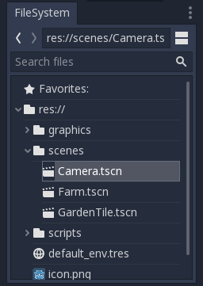
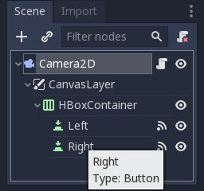

# Godot Beginner's Guide

Quick start guide for Godot.

### Project Manager

The first thing you see when opening Godot is the project manager.
You have a list of projects being managed by Godot (including a "favorite" star button to pin projects)
and several buttons for managing projects. To add an existing project,
use the “Scan” feature to search a folder (and its sub-folders) for all projects it can find.
Godot `2.1` projects can’t import into Godot `3.0` without converting the project.
Godot `2.1` has a converter but it may not work well.
Godot `3.0` projects should work in `3.1`, but `3.1` files won’t work in `3.0`.

To create a new project, you need an empty folder. Once you have your folder then click OK. Now "Edit" (load/open) your project.
You can also run your projects from the project manager without launching the editor ("Run" feature).

### File System

Godot refers to your project folder as "res://" and contains your static game files used to compile your export.
Godot also has another special address prefix "user://" for dynamic data.
Essentially the *user directory* "user://" is for game saves or generated map data caching.
If you download add-ons from the Godot asset library, they should go to "res://addons/" folder in your project. Organize your project files using folders.
One folder for graphics, one for sounds, one for scripts, whatever makes sense to you.



Godot converts resource files (like images) into its own format, which you can see in the “res://.import” folder.
Resources can be re-imported from the editor by selecting your file in the file browser.
Your import preferences are saved per file in a \*.import file (`my_image.png.import` for example)

### Objects

[`Node`](https://docs.godotengine.org/en/3.1/classes/class_node.html) objects are the main object type you will work with in the editor.
Each scene is built out of nodes and saved to a file (TSCN or “text-scene”).
You can include scenes into other scenes and update them later (Inherit Scene).
You can build up your game parts (player, level, enemy, enemy spawner) and combine them in different ways.

Inside a [`Node`](https://docs.godotengine.org/en/3.1/classes/class_node.html) you have *properties* and *functions*.
They also have signals for calling functions when an event happens.
Functions control game logic by editing properties or calling engine functions.
Objects (a Node is a Reference which is an Object) inherit all the properties and functions of their parent object.
[`Node2D`](https://docs.godotengine.org/en/3.1/classes/class_node2d.html) has all the info and tools available in
[`Node`](https://docs.godotengine.org/en/3.1/classes/class_node.html),
because [`Node2D`](https://docs.godotengine.org/en/3.1/classes/class_node2d.html) is a child of [`Node`](https://docs.godotengine.org/en/3.1/classes/class_node.html).

A common example for signals is when using a [`Timer`](https://docs.godotengine.org/en/3.1/classes/class_timer.html) node.
The "timeout" signal calls a function when the timer is up.
You can define a signal in your script, then call `emit_signal` when the signal's event happens.
Signals are fast, but you have to choose where to call `emit_signal`.

*Example: Using a timer.*
```gdscript
extends Node

onready var my_timer = Timer.new()

func _ready():
    my_timer.wait_time = 0.5
    my_timer.connect( “timeout”, self, “_timer_done” ) #connect signal
    self.add_child( my_timer )
    my_timer.start()

func _timer_done():
    print(“Timer finished.”) #print to console output (seen in editor)
```

*Example: Creating a signal.*

```gdscript
extends Node2D

signal got_hurt (damage)  

onready var hitpoints = 10 setget set_hitpoints

func set_hitpoints( new_hp ):
    var diff = new_hp - hitpoints
    if diff < 0:
        emit_signal("got_hurt", diff)
    hitpoints = new_hp
```

### SceneTree

Making a game in Godot begins with creating a scene. Inside a scene you assemble Nodes,
and each scene begins with exactly one Node (of your choosing). Each node can have many children (as many as you want).
This creates what we call a “tree” of nodes, and thus the name [`SceneTree`](https://docs.godotengine.org/en/3.1/getting_started/step_by_step/scene_tree.html).
When making a 2D scene your top node should be a [`Node2D`](https://docs.godotengine.org/en/3.1/classes/class_node2d.html) or child of
[`Node2D`](https://docs.godotengine.org/en/3.1/classes/class_node2d.html).
When making a 3D scene start with a [`Spatial`](https://docs.godotengine.org/en/3.1/classes/class_spatial.html) type node.
[`Control`](https://docs.godotengine.org/en/3.1/classes/class_control.html) nodes (user interface widgets) are 2D
but work different from [`Node2D`](https://docs.godotengine.org/en/3.1/classes/class_node2d.html) objects.
The two work best when separated (you can separate with a [`CanvasLayer`](https://docs.godotengine.org/en/3.1/classes/class_canvaslayer.html) as child node).
You can use 2D nodes in your 3D scene but they should be at the bottom of your node list (so they draw on top).

When you run your game you start with running a scene.
It runs inside the [`SceneTree`](https://docs.godotengine.org/en/3.1/getting_started/step_by_step/scene_tree.html) object,
which holds the node tree of your scene. Any GDScript attached to your scene can access the
[`SceneTree`](https://docs.godotengine.org/en/3.1/getting_started/step_by_step/scene_tree.html) by calling `get_tree()`.

In 2D: the engine draws sprites to screen in order.
The Sprite node at the top of the SceneTree is drawn first, and at the end of the node tree Sprites are drawn last.
Background sprites go at the top of the list of nodes in your Godot editor. UI nodes (Control) go below Node2D objects.

Sometimes you want sprites to switch order, to change which is drawn on top.
If you want to order them based on their position.y value,
then make them children (`y_sort_node.add_child()`) of a [`YSort`](https://docs.godotengine.org/en/3.1/classes/class_ysort.html) node.



You can access nodes belonging to a group from the SceneTree.
Use the code `get_tree().get_nodes_in_group("enemies")` to get all nodes in group "enemies".

- 2D objects use X and Y positioning:
  - X positive (+) is right; negative (-) is left.
  - Y positive is down; negative is up.

- 3D objects use X, Y, and Z positioning:
  - X and Z form the floor plane. (Left, right, forward, backwards)
  - Y positive is up; negative is down.

### GDScript

GDscript is Godot's default coding language.
You save it to a text file ending with .gd or save it built-in to any
[`Node`](https://docs.godotengine.org/en/3.1/classes/class_node.html) object.
The script has to start with `extends Node` or replace "Node" with the type you'll attach the script to.
Leaving out "extends" is the same as `extends Reference` which is a data type you don't add to the
[`SceneTree`](https://docs.godotengine.org/en/3.1/getting_started/step_by_step/scene_tree.html).

[Link: @GDScript Built-in Functions](https://docs.godotengine.org/en/3.1/classes/class_@gdscript.html)

### Native Code

GDScript is great, but it isn't 100% the fastest option. When you need extra speed, you can use C++ as a Native module.
For 2D, GDScript can manage running the whole game. For 3D you might need C++ for your dynamic world building code (or whatever intensive code you’re making).

The benefits gained from using GDScript should outweigh the minor speed loss.
Signals and groups are tools to help you build efficient scenes.

### Physics

The physics engine nodes are:

+ `StaticBody` - Non-moving solid physical obstacle.

+ `RigidBody` - Moving physical object. Managed by engine.

+ `KinematicBody` - Moving physical object. Managed by you the coder.

+ `Area` - Non-obstacle. Detects overlap with other physics bodies or areas.

+ `VehicleBody` - Simulate a moving vehicle with wheels. Includes drive and steering wheel functionality.

+ `RayCast` - Check along a directed line for any physics object; fast and effective check.

`VehicleBody` is only available in 3D. Godot 3.1 will also include a `PhysicalBone` physics object for 3D.

Physics objects need to have a `CollisionShape` (or `CollisionPolygon`) as a child node.
This tells the engine how big and what shape the object is.

All physics objects have collision layers and collision masks.
The collision layer represents which layer(s) the object is on.
The mask represents which layers the object collides with.
So an object with layer 1 and mask 2 will collide with objects on layer 2,
but not layer 1 (so no collision with other instances).

Note that you only need `KinematicBody` to move objects that collide.
Otherwise you can change the position/translation property to move the object.
For smooth movement you can use a `Tween` to control the transition.

For the next code you need to define the “move_left” and “move_right” actions.
The "Input Map" is in project settings. You also need some `StaticBody2D` nodes to collide with.

*Example: Move a side-scroll platform character using action inputs.*

```gdscript
extends KinematicBody2D

const GRAVITY = Vector2(0,98)
const SPEED = 500
onready var direction = Vector2(0,0)

func _process(delta):
    if Input.is_action_pressed(“move_right”):
        direction.x = 1
    elif Input.is_action_pressed(“move_left”):
        direction.x = -1
    else:
        direction.x = 0

func _physics_process(delta):
    move_and_slide( (direction * SPEED) + GRAVITY )
```

    **NOTE**: When using KinematicBody's `move_and_collide` function, you should multiply the argument by `delta`  
    When using `move_and_slide` you should **NOT** multiply by 'delta' because the 'slide' functions manage this automatically.
  

[Link: More physics info.](https://docs.godotengine.org/en/3.1/tutorials/physics/index.html)

### Node2D

When building a 2D scene you use [`Node2D`](https://docs.godotengine.org/en/3.1/classes/class_node2d.html) objects.
There are many nodes based on [`Node2D`](https://docs.godotengine.org/en/3.1/classes/class_node2d.html) such as
[`Camera2D`](https://docs.godotengine.org/en/3.1/classes/class_camera2d.html), `RigidBody2D`, etc.

To display an image you’ll use a [`Sprite`](https://docs.godotengine.org/en/3.1/classes/class_sprite.html) or an
[`AnimatedSprite`](https://docs.godotengine.org/en/3.1/classes/class_animatedsprite.html) node.
A [`Sprite`](https://docs.godotengine.org/en/3.1/classes/class_sprite.html) accepts one image at a time.
An [`AnimatedSprite`](https://docs.godotengine.org/en/3.1/classes/class_animatedsprite.html) has a series of animation tracks that can each hold many images.
You can control the view of your scene using a [`Camera2D`](https://docs.godotengine.org/en/3.1/classes/class_camera2d.html).
For 2D tiled games you might want to enable “Pixel Snap” from your project settings.

*Example: Object movement without using physics.*

```gdscript
extends Sprite

const SPEED = 200
onready var direction = 0

func _input(event):
    if event is InputEventKey:
        if event.pressed:
            match event.scancode:
                KEY_LEFT:
                    direction = -1
                KEY_RIGHT:
                    direction = 1
        else:
            match event.scancode:
                KEY_LEFT, KEY_RIGHT:
                    direction = 0

func _process(delta):
    position.x += direction * SPEED * delta
```

[Link: `InputEvent`](https://docs.godotengine.org/en/3.1/tutorials/inputs/inputevent.html)

Here I defined a constant (can’t change value) called SPEED.
I used the “onready” keyword to initialize the variable when the Node becomes “ready”.

For input, make sure the `InputEvent` is an [`InputEventKey`](https://docs.godotengine.org/en/3.1/classes/class_inputeventkey.html)
(so I know I can call `event.scancode` or `event.pressed`).
Then, if pressed I set the direction, or else set the direction variable to zero.

In `_process` I move the X position of the 'Sprite' based on the direction they want to go (1 or -1) multiplied by SPEED and `delta`.
The [`Sprite`](https://docs.godotengine.org/en/3.1/classes/class_sprite.html) inherits `position` from [`Node2D`](https://docs.godotengine.org/en/3.1/classes/class_node2d.html). The `delta` variable is a number for how much time passed between engine calls to `_process`. Multiply this by your speed so that movement is consistent with time itself. This makes movement consistent between different computers too.

The same in 3D ([`Spatial`](https://docs.godotengine.org/en/3.1/classes/class_spatial.html) nodes) uses the `translation` property instead of `position`.

### Control

[`Control`](https://docs.godotengine.org/en/3.1/classes/class_control.html) nodes are for dynamic user interfaces.
They don't interact with [`Node2D`](https://docs.godotengine.org/en/3.1/classes/class_node2d.html) objects by default. You can still access info from both, and relate them yourself. A [`Control`](https://docs.godotengine.org/en/3.1/classes/class_control.html) has `rect_position` and a [`Node2D`](https://docs.godotengine.org/en/3.1/classes/class_node2d.html) has `position`. If you need a [`Sprite`](https://docs.godotengine.org/en/3.1/classes/class_sprite.html) or something equal for your [`Control`](https://docs.godotengine.org/en/3.1/classes/class_control.html) nodes, try a [`TextureRect`](https://docs.godotengine.org/en/3.1/classes/class_texturerect.html). Most [`Control`](https://docs.godotengine.org/en/3.1/classes/class_control.html) nodes also support displaying an image icon next to text (or instead of text). [`Control`](https://docs.godotengine.org/en/3.1/classes/class_control.html) nodes are good at stealing mouse focus. You can change mouse event behavior from the inspector.

### Tilemap

You can build your game world out of a `Tilemap` (2D) or a `Gridmap` (3D).
You can also write your own level creation/management nodes.

`Tilemap` and `Gridmap` each use a compiled Tileset (2D) or MeshLibrary (3D) to build their tiles.
A tileset (or meshlib) only contains some types of data.
These include [`Sprite`](https://docs.godotengine.org/en/3.1/classes/class_sprite.html) (`Mesh`),collision shape, and navigation mesh.

#### Creating a Tileset

- [Link: Old Method (also applies to MeshLibrary (3D))](https://www.gamefromscratch.com/post/2015/04/28/Godot-Engine-Tutorial-Part-8-Tilemaps.aspx)

- [Link (youtube video): New Method](https://www.youtube.com/watch?v=F6VerW98gEc)

### Linear Algebra

Linear algebra is where Vectors and Matrices (matrix) come from.
It lets us do complex things fast and simple.
This is good for realtime computing, and thus good for video games.
Having knowledge of vectors and how they work is usually enough for a 2D game,
but you might want to learn about matrices when working with 3D.

Vectors can have 2 or more components, but for games we’re only interested in 2-component and 3-component vectors.
Godot provides us with `Vector2` and `Vector3` integrated data types.
There are also the `Transform2D` and `Transform` objects.
Call the `xform` function to transform your vectors according to your `Transform`.

[Link: Godot Math Docs](https://docs.godotengine.org/en/3.1/tutorials/math/)

